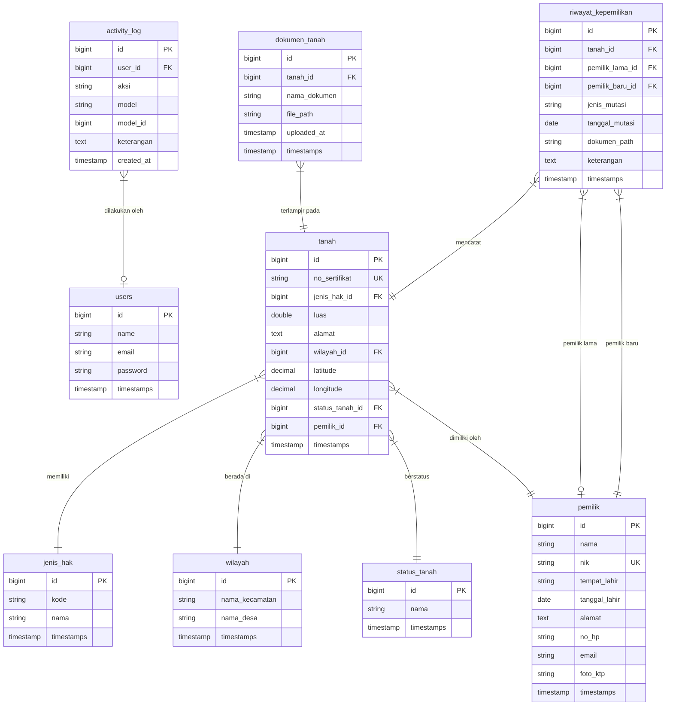

<p align="center"><a href="https://laravel.com" target="_blank"></a></p>

<p align="center">
<a href="https://github.com/laravel/framework/actions"></a>
<a href="https://packagist.org/packages/laravel/framework"></a>
<a href="https://packagist.org/packages/laravel/framework"></a>
<a href="https://packagist.org/packages/laravel/framework"></a>
</p>

## About Laravel

Laravel is a web application framework with expressive, elegant syntax. We believe development must be an enjoyable and creative experience to be truly fulfilling. Laravel takes the pain out of development by easing common tasks used in many web projects, such as:

- [Simple, fast routing engine](https://laravel.com/docs/routing).
- [Powerful dependency injection container](https://laravel.com/docs/container).
- Multiple back-ends for [session](https://laravel.com/docs/session) and [cache](https://laravel.com/docs/cache) storage.
- Expressive, intuitive [database ORM](https://laravel.com/docs/eloquent).
- Database agnostic [schema migrations](https://laravel.com/docs/migrations).
- [Robust background job processing](https://laravel.com/docs/queues).
- [Real-time event broadcasting](https://laravel.com/docs/broadcasting).

Laravel is accessible, powerful, and provides tools required for large, robust applications.

## Learning Laravel

Laravel has the most extensive and thorough [documentation](https://laravel.com/docs) and video tutorial library of all modern web application frameworks, making it a breeze to get started with the framework.

In addition, [Laracasts](https://laracasts.com) contains thousands of video tutorials on a range of topics including Laravel, modern PHP, unit testing, and JavaScript. Boost your skills by digging into our comprehensive video library.

You can also watch bite-sized lessons with real-world projects on [Laravel Learn](https://laravel.com/learn), where you will be guided through building a Laravel application from scratch while learning PHP fundamentals.

## Agentic Development

Laravel's predictable structure and conventions make it ideal for AI coding agents like Claude Code, Cursor, and GitHub Copilot. Install [Laravel Boost](https://laravel.com/docs/ai) to supercharge your AI workflow:

```bash
composer require laravel/boost --dev

php artisan boost:install
```

Boost provides your agent 15+ tools and skills that help agents build Laravel applications while following best practices.

## Fitur Sipektatu (Pencatatan Kepemilikan Tanah)

### 1. Login Sederhana Tanpa Autentikasi
Sipektatu dikonfigurasi dengan sistem login cepat tanpa memerlukan data kredensial database.
- **Akses Rute**: `/` (Halaman utama/login).
- **Perilaku**: Pengguna dapat mengisi nama pengguna (username) dan password apa saja, atau membiarkannya kosong.
- **Default**: Jika dikosongkan, sistem otomatis masuk sebagai admin **sipektatu**.
- **Sesi**: Berhasil login akan menyimpan informasi ke sesi (`admin_logged_in` dan `admin_username`).

### 2. Dashboard Analitis Interaktif
Setelah login, pengguna diarahkan ke dashboard utama yang menyajikan ringkasan data penting secara real-time.
- **Akses Rute**: `/dashboard` (Membutuhkan status login di sesi).
- **Fitur Tampilan & Konten**:
  - **Sidebar Navigasi**: Berisi menu interaktif (Dashboard, Data Pemilik, Data Tanah, Kepemilikan & Mutasi, Master Data, Peta, Laporan, Pengaturan).
  - **Header Modern**: Menyapa admin secara dinamis sesuai nama yang diinputkan saat login, serta menampilkan inisial avatar.
  - **Tombol Keluar (Logout)**: Menghapus data sesi dan mengarahkan kembali ke halaman login.
  - **Kartu Statistik (Stats Cards)**: Menyajikan data agregat dinamis seperti Total Bidang Tanah, Total Pemilik Terdaftar, Total Luas Lahan (dalam m² dan Hektar), serta ringkasan pembagian Jenis Hak (SHM, HGB, HGU, Girik, dll.).
  - **Grafik Interaktif (Chart.js)**: 
    - Grafik Batang (Bar Chart) menampilkan sebaran jumlah bidang tanah terdaftar untuk masing-masing desa/wilayah.
    - Grafik Donat (Doughnut Chart) menampilkan proporsi sebaran klasifikasi bidang tanah berdasarkan jenis haknya.
  - **Tabel Aktivitas Terakhir**: Menampilkan log 7 transaksi mutasi atau registrasi tanah terbaru secara kronologis dengan penanda badge jenis mutasi dan waktu relatif yang ramah dibaca (misal: "2 hours ago").

### 3. Pengelolaan Master Data (CRUD)
Sipektatu menyediakan antarmuka modern glassmorphic untuk mengelola data referensi pendukung sertifikasi tanah secara lengkap.
- **Akses Rute**:
  - **Jenis Hak Tanah**: `/dashboard/master-data/jenis-hak`
  - **Wilayah**: `/dashboard/master-data/wilayah`
  - **Status Tanah**: `/dashboard/master-data/status-tanah`
- **Fitur CRUD**:
  - **Daftar Data**: Menampilkan data referensi secara dinamis dengan desain tabel premium.
  - **Modal Tambah & Ubah**: Form tambah dan ubah data muncul secara cepat menggunakan overlay modal glassmorphic modern.
  - **Integrasi Keamanan**: Sistem secara otomatis menolak penghapusan data referensi (Jenis Hak, Wilayah, Status Tanah) yang masih terhubung/terkait dengan data Tanah aktif untuk menjaga integritas database.

### 4. Manajemen Data Pemilik (CRUD & Unggah KTP)
Modul ini mengelola data profil identitas pemilik tanah terdaftar di dalam sistem.
- **Akses Rute**: `/dashboard/pemilik` (Terproteksi sesi admin)
- **Fitur Utama**:
  - **Listing Pemilik**: Menampilkan nama lengkap pemilik, NIK, nomor HP, jumlah bidang tanah yang dimiliki saat ini, serta tombol aksi.
  - **Form Tambah & Ubah**: Formulir penginputan nama lengkap, NIK (16 digit unik), tempat & tanggal lahir, alamat domisili, nomor HP, email (opsional), serta unggah file foto/scan KTP (maksimal 5MB).
  - **Profil Detail**: Halaman rincian pemilik yang menampilkan detail profil lengkap, preview foto KTP, tabel daftar bidang tanah aktif yang dimiliki, dan timeline kronologi seluruh transaksi/mutasi tanah yang melibatkan pemilik tersebut (baik saat mendaftar, membeli, maupun menjual tanah).
  - **Integritas Penghapusan**: Dilengkapi proteksi keamanan transaksi database yang menolak penghapusan data pemilik jika yang bersangkutan masih terdaftar memiliki bidang tanah aktif.

### 5. Registrasi & Manajemen Data Tanah (CRUD & Histori Mutasi)
Modul ini merupakan inti dari aplikasi Sipektatu yang mengelola seluruh data pendaftaran kapling tanah secara komprehensif.
- **Akses Rute**: `/dashboard/tanah` (Terproteksi sesi admin)
- **Fitur Utama**:
  - **Listing Tanah**: Menampilkan daftar sertifikat tanah terdaftar (no. sertifikat, luas dalam m², lokasi desa/kecamatan, jenis hak tanah, status, dan pemilik saat ini).
  - **Form Registrasi & Ubah**: Input no. sertifikat, jenis hak (dropdown), luas (m²), alamat/lokasi, wilayah (dropdown), koordinat lintang/bujur (opsional), serta unggah file dokumen pendukung (maksimal 5MB).
  - **Unggah Lampiran Digital**: Dukungan unggah pindaian scan sertifikat (PDF, JPG, PNG) dan foto lokasi fisik tanah (JPG, PNG) yang disimpan dengan aman pada direktori public storage.
  - **Detail Tanah & Integrasi Peta**: Rincian informasi kapling tanah lengkap dengan tautan peta eksternal Google Maps berbasis koordinat latitude & longitude terdaftar.
  - **Timeline Histori Kepemilikan**: Sistem secara cerdas mencatat kronologi kepemilikan. Registrasi awal dicatat sebagai "Pendaftaran". Ketika pemilik aktif diganti melalui form ubah tanah, sistem secara otomatis memicu pencatatan mutasi kepemilikan baru, merekam data pemilik lama, pemilik baru, tanggal mutasi, serta keterangan ke dalam riwayat kepemilikan.

### 6. Transaksi Kepemilikan & Mutasi
Modul ini mengelola pencatatan transaksi peralihan hak kepemilikan bidang tanah secara hukum.
- **Akses Rute**: `/dashboard/mutasi` (Terproteksi sesi admin)
- **Fitur Utama**:
  - **Listing Mutasi**: Rekam historis ledger transaksi perpindahan kepemilikan tanah. Menampilkan info sertifikat tanah, pemilik sebelumnya (lama), pemilik baru (sekarang), jenis transaksi, tanggal mutasi, berkas lampiran, dan tombol pembatalan.
  - **Form Catat Mutasi Baru**: Formulir pencatatan perpindahan kepemilikan. Menyediakan dropdown pilihan bidang tanah dengan tampilan info pemilik aktif yang terisi secara otomatis menggunakan JavaScript reactive, pilihan target pemilik baru, jenis mutasi (Jual Beli, Waris, Hibah, Tukar Guling), tanggal mutasi, catatan deskripsi/keterangan, serta berkas unggahan bukti (akta, surat waris, dll.).
  - **Aturan Bisnis & Validasi**: Menolak pencatatan mutasi jika pemilik baru yang dipilih sama dengan pemilik aktif tanah saat ini.
  - **Pembatalan Transaksi & Reversi Kepemilikan**: Menghapus data log transaksi mutasi (kecuali pendaftaran awal) secara otomatis memicu pengembalian status hak milik bidang tanah kembali ke pemilik sebelumnya (`pemilik_lama_id`) serta menghapus file fisik dokumen dari penyimpanan.

### 7. Laporan & Rekapitulasi (Ekspor Excel & Cetak PDF)
Modul ini menyediakan dashboard analisis dan pelaporan data pertanahan yang komprehensif untuk mendukung pengambilan keputusan.
- **Akses Rute**: `/dashboard/laporan` (Terproteksi sesi admin)
- **Fitur Utama**:
  - **Laporan Bidang Tanah**: Menyediakan tabel daftar bidang tanah terdaftar lengkap dengan panel filter (Wilayah Desa/Kecamatan, Jenis Hak, Status Tanah). Menyajikan kartu ringkasan total bidang dan total luas tanah yang tersaring secara real-time.
  - **Rekapitulasi Luas per Wilayah**: Menyajikan tabel rekapitulasi sebaran luas tanah per wilayah desa/kecamatan, mencakup total bidang, total luas tanah, dan persentase kontribusi luas terhadap seluruh wilayah terdaftar.
  - **Laporan Mutasi Periode**: Melacak perpindahan hak milik tanah dalam rentang tanggal tertentu (default bulan berjalan) yang dikombinasikan dengan filter wilayah dan jenis hak. Menyajikan detail breakdown statistik jenis mutasi (Jual Beli, Waris, Hibah, Tukar Guling).
  - **Fitur Cetak & Ekspor**:
    - **Ekspor Excel**: Mengunduh berkas format CSV terenkode UTF-8 BOM secara dinamis menggunakan output stream PHP, sehingga langsung rapi dan terbaca sempurna saat dibuka di Microsoft Excel.
    - **Cetak PDF**: Rute cetak terdedikasi menggunakan template CSS minimalis dengan kontras tinggi (print-friendly) yang secara otomatis memicu dialog cetak PDF sistem operasi/browser (`window.print()`).

### 8. Skema Database
Sipektatu menggunakan database MySQL dengan skema relasional yang dirancang untuk pelacakan kepemilikan dan mutasi tanah. Berikut adalah struktur entity-relationship (ER) dari database:



#### Deskripsi Tabel:
1. **users**: Tabel default Laravel untuk data user admin.
2. **wilayah**: Menyimpan data administrasi wilayah kecamatan dan desa.
3. **jenis_hak**: Tipe sertifikasi tanah (contoh: SHM, HGB, HGU, Girik).
4. **status_tanah**: Kondisi hukum/status tanah saat ini (contoh: Aktif, Sengketa, Dijual, Dalam Proses).
5. **pemilik**: Data pribadi pemilik tanah beserta NIK (unik) dan alamat.
6. **tanah**: Data persil tanah utama yang terhubung dengan jenis hak, pemilik aktif, wilayah, dan status tanah.
7. **dokumen_tanah**: Kumpulan dokumen digital lampiran pendukung tanah (sertifikat scan, AJB scan, dll).
8. **riwayat_kepemilikan**: Log histori mutasi kepemilikan tanah secara mendetail (jual-beli, waris, hibah, dll) yang mencatat pemilik lama dan pemilik baru.
9. **activity_log**: Log aktivitas internal admin/user dalam sistem.

### 6. Fitur Penyesuaian Tingkat Desa (Desa Tunggorono, Kutoarjo)
Sipektatu telah disesuaikan secara khusus untuk lingkup administrasi tingkat desa (Desa Tunggorono) dengan penyesuaian sebagai berikut:
- **Wilayah RT/RW/Dusun**: Form dan tabel Master Data Wilayah disesuaikan untuk mengelola **Nama Dusun/Kebayan**, **Nomor RW**, dan **Nomor RT** dengan nilai default Kecamatan Kutoarjo dan Desa Tunggorono.
- **Pencatatan Buku Letter C & Persil**: Form registrasi tanah dan detil tanah kini mendukung penyimpanan data **Buku Letter C**, **Nomor Persil**, dan **Klasifikasi Tanah Adat** (contoh: S.I, S.II, D.I, D.II) untuk mengakomodasi pencatatan tanah yasan.
- **Tanah Bengkok / Kas Desa (TKD)**: Menambahkan pilihan status tanah **Bengkok Pamong Desa** (Kades, Sekdes, Perangkat) dan **Tanah Kas Desa (TKD)** / Wakaf untuk memudahkan pengelolaan inventaris aset desa.

---

## Contributing

Thank you for considering contributing to the Laravel framework! The contribution guide can be found in the [Laravel documentation](https://laravel.com/docs/contributions).

## Code of Conduct

In order to ensure that the Laravel community is welcoming to all, please review and abide by the [Code of Conduct](https://laravel.com/docs/contributions#code-of-conduct).

## Security Vulnerabilities

If you discover a security vulnerability within Laravel, please send an e-mail to Taylor Otwell via [taylor@laravel.com](mailto:taylor@laravel.com). All security vulnerabilities will be promptly addressed.

## License

The Laravel framework is open-sourced software licensed under the [MIT license](https://opensource.org/licenses/MIT).
